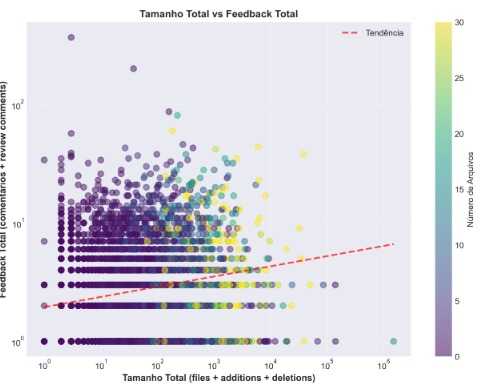
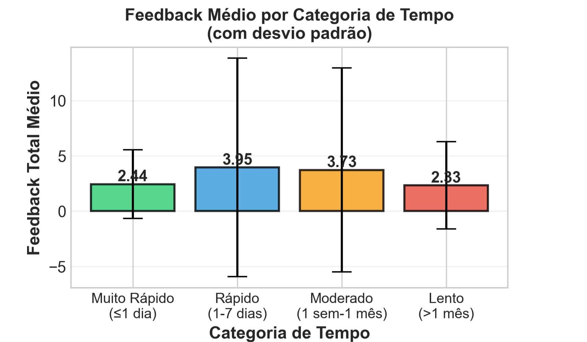
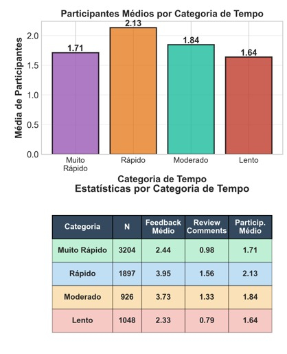
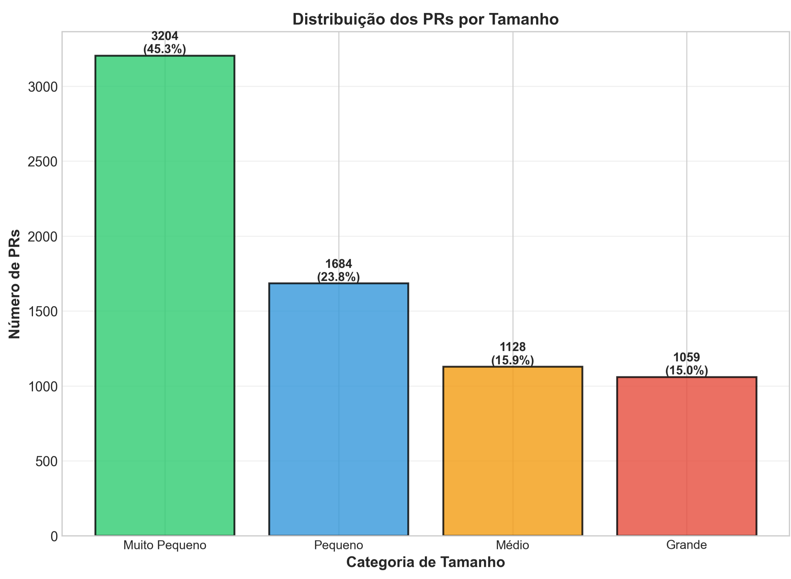
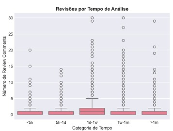

# 📝 Relatório Técnico de Laboratório

## 1. Informações do grupo
- **🎓 Curso:** Engenharia de Software
- **📘 Disciplina:** Laboratório de Experimentação de Software
- **🗓 Período:** 6° Período
- **👨‍🏫 Professor(a):** Prof. Wesley Dias Maciel
- **👥 Membros do Grupo:** Sophia Mendes, Thiago Andrade

---

## 2. Introdução

Este trabalho teve como objetivo caracterizar a atividade de code review em repositórios populares do GitHub, buscando compreender quais fatores influenciam o resultado final de um PR. Para isso, foram coletados dados de repositórios amplamente utilizados na plataforma, considerando apenas PRs revisados manualmente, com pelo menos uma revisão e tempo mínimo de análise de uma hora, para excluir revisões automáticas realizadas por bots ou pipelines de CI/CD.

### 2.1. Questões de Pesquisa (Research Questions – RQs)
**Questões de Pesquisa - Research Questions (RQs):**

| RQ   | Pergunta |
|------|----------|
| RQ01 | Qual a relação entre o tamanho dos PRs e o feedback final das revisões? |
| RQ02 | Qual a relação entre o tempo de análise dos PRs e o feedback final das revisões? |
| RQ03 | Qual a relação entre a descrição dos PRs e o feedback final das revisões? |
| RQ04 | Qual a relação entre as interações nos PRs e o feedback final das revisões? |
| RQ05 | Qual a relação entre o tamanho dos PRs e o número de revisões realizadas? |
| RQ06 | Qual a relação entre o tempo de análise dos PRs e o número de revisões realizadas? |
| RQ07 | Qual a relação entre a descrição dos PRs e o número de revisões realizadas? |
| RQ08 | Qual a relação entre as interações nos PRs e o número de revisões realizadas? |

### 2.2. Hipóteses Informais (Informal Hypotheses – IH)

| IH   | Descrição |
|------|-----------|
| IH01 | PR's maiores tendem a receber feedbacks mais criticos|
| IH02 | Quanto mais tempo de revisão, mais crítico será o feedback e menos chance de ser aprovado de primeira. Quanto menos tempo, mais rápido é a aprovação. |
| IH03 | PRs com descrições mais detalhadas e completas tenderiam a gerar menos comentários de revisão |
| IH04 | PRs que envolvem mais interações entre os colaboradores tendem a gerar revisões mais detalhadas e com maior volume de feedbacks |
| IH05 | Quanto maior o PR , maior o número de revisões/rodadas necessárias até a aprovação. |
| IH06 | PRs com maior tempo de análise costumam exigir mais ciclos de revisão antes da aprovação. |
| IH07 | PR's com descrições mais detalhadas precisam de menos revisões |
| IH08 | PR's com mais discussões precisam de menos revisões |

---

## 3. Metodologia

Para coletar os dados da análise, foi utilizada a API REST do GitHub, que possibilitou acessar de forma organizada as informações dos repositórios e pull requests (PRs). Foram selecionados os 200 repositórios mais populares da plataforma, buscando representar projetos amplamente usados pela comunidade open source.

De cada repositório, foram extraídas as principais métricas e informações dos PRs, como número de arquivos alterados, linhas adicionadas e removidas, tempo de análise, quantidade de revisões, descrição e interações entre os participantes. Todos os dados foram reunidos em um arquivo CSV chamado Dataset, utilizado depois nas etapas de análise e visualização dos resultados.

A coleta foi automatizada com scripts em Python, utilizando ThreadPoolExecutor para realizar várias requisições ao mesmo tempo e tornar o processo mais rápido e eficiente.

---
## 4. Dificuldades

Dificuldades e desafios estiveram presentes em todas as etapas do trabalho. A coleta de dados foi especialmente desafiadora: foi preciso iterar diversas vezes até definir uma estratégia de paralelização das requisições que não ultrapassasse o rate limit da API. Mesmo reduzindo o número de PRs analisados, a geração do dataset demandou mais de 48 horas de execução.
Na análise dos dados, a complexidade também foi alta. Enfrentei dificuldades para selecionar as abordagens estatísticas mais adequadas e para implementar os procedimentos analíticos, ainda que a automação de gráficos tenha ajudado na exploração inicial.

---

### 5 Métricas

#### 📊 Métricas de Laboratório - Lab Metrics (LM)
| Código | Métrica | Descrição |
|--------|---------|-----------|
| LM01 | Tamanho | número de arquivos; total de linhas adicionadas e removidas |
| LM02 | Tempo de Análise | intervalo entre a criação do PR e a última atividade (fechamento ou merge). |
| LM03 | Descrição | número de caracteres do corpo de descrição do PR (na versão markdown) |
| LM04 | Interações: | número de participantes; número de comentários. |

---

## 6. Resultados & Discussões

#### RQ1 - 

  

O tamanho por si só é um preditor fraco de feedback; alguns PRs grandes recebem muita atenção, mas a maioria (pequenos ou grandes) recebe pouco. Em termos práticos, preferir PRs menores e focados (ou quebrar PRs muito amplos) tende a favorecer revisões mais efetivas e distribuídas.

A hipotese foi parcialmente refutada, pois os dados de indicam correlação positiva fraca entre tamanho do PR e feedback total: PRs maiores têm maior chance de gerar discussões mais extensas, porém a maioria (inclusive muitos PRs grandes) recebe pouco feedback.

#### RQ2 - 

  

  

Neste gráfico, vemos que o engajamento com PRs segue uma curva em U invertido. O pico de feedback ocorre quando a análise leva de 1 a 7 dias: é quando temos mais comentários e mais participantes. PRs muito rápidos tendem a receber menos discussão, possivelmente por serem triviais, e PRs que se arrastam por mais de um mês perdem tração

Disussão: PRs que são resolvidos muito rapidamente (em menos de 1 dia) tendem a ser mudanças simples que genuinamente não requerem discussão extensiva. No entanto, é importante que as equipes verifiquem se não estão negligenciando revisões necessárias em favor da velocidade. Por outro lado, PRs que ultrapassam 1 mês de análise entram em uma zona crítica onde o feedback praticamente estagna, caindo para níveis inferiores aos dos PRs triviais

#### RQ3 - 

  

  Os dados do gráfico mostram que a maioria dos Pull Requests possui descrições curtas, geralmente com menos de 5.000 caracteres, e poucos comentários de revisão, concentrando-se entre 0 e 3. À medida que o tamanho da descrição aumenta, o número de comentários permanece baixo, com poucos casos isolados de PRs mais extensos. A correlação de Spearman (ρ = 0.167, p < 0.00001) indica uma relação positiva muito fraca entre as variáveis.

  Discussão: A hipótese não foi confirmada. Embora descrições mais longas pareçam, visualmente, associar-se a menos comentários, o resultado estatístico indica uma correlação fraca e positiva (ρ = 0,167). Isso ocorre porque a maior parte dos PRs possui descrições curtas, nas quais há grande variação no número de comentários, influenciando o resultado global. Assim, conclui-se que o tamanho da descrição tem pouca influência prática no volume de feedbacks durante a revisão.

#### RQ4 - 

  

Os dados do gráfico mostram que a maioria dos Pull Requests possui baixa quantidade de interações, com poucos participantes e comentários concentrados nas faixas iniciais. À medida que o número de participantes aumenta, observa-se um crescimento proporcional no número de comentários de revisão. A correlação de Spearman (ρ = 0.662, p < 0.00001) indica uma relação positiva forte entre as variáveis.

Discussão: A hipótese foi confirmada. Observou-se que PRs com mais interações entre os colaboradores apresentam maior volume de comentários, indicando revisões mais participativas e detalhadas. Isso sugere que quanto maior o envolvimento coletivo no processo de revisão, mais extensas tendem a ser as discussões e os feedbacks gerados até a aprovação final.

#### RQ5 - 

  

O gráfico mostra que o conjunto é fortemente concentrado em PRs “Muito Pequenos” (≈45%), seguidos de Pequenos (≈24%); Médios e Grandes somam ~16% cada. Isso significa que, em termos de volume bruto de revisões, os menores inevitavelmente dominam o total simplesmente porque são muito mais numerosos.
A hipotese é refutada, pois há apenas risco ligeiramente maior de discussões longas em PRs grandes, não um crescimento consistente de revisões conforme o tamanho aumenta.

#### RQ6 - 

  

Mais tempo não implica mais revisões. O volume de revisões tende a ser maior quando o PR é analisado entre 1 dia e 1 mês (sobretudo 1–7 dias), enquanto PRs muito rápidos e muito lentos recebem menos ciclos de revisão.
Ou seja, hipotese foi refutada

#### RQ7 - 

  

Os dados do gráfico mostram que a maioria dos Pull Requests possui descrições curtas, com menos de 5.000 caracteres, e baixo número de revisões, concentrando-se entre 0 e 3 comentários. Mesmo com o aumento do tamanho das descrições, o número de revisões tende a permanecer baixo, sem variação significativa. A correlação de Spearman (ρ = 0.167, p < 0.00001) indica uma relação positiva muito fraca entre o tamanho da descrição e o número de revisões realizadas.

Discussão: A hipótese não foi confirmada. Esperava-se que descrições mais longas resultassem em menos revisões, por facilitarem o entendimento das mudanças propostas, mas os dados mostram que o tamanho da descrição tem pouca influência no número de revisões realizadas. A correlação fraca indica que fatores como a complexidade do código ou o tipo de alteração parecem ter maior impacto na quantidade de feedbacks durante o processo de revisão.

#### RQ8 - 

  

Os dados do gráfico mostram que a maioria dos Pull Requests se concentra entre 1 e 10 participantes e entre 1 e 10 revisões. À medida que o número de participantes aumenta, observa-se também um aumento proporcional no número de revisões realizadas. A correlação de Spearman (ρ = 0.662, p < 0.00001) indica uma relação positiva forte entre as variáveis.

Discussão: A hipótese não foi confirmada. Esperava-se que PRs com mais discussões precisassem de menos revisões, porém os dados mostram o contrário: quanto maior o número de participantes, maior também o número de revisões realizadas. Isso indica que a presença de mais colaboradores tende a gerar um processo de revisão mais extenso e detalhado, com mais rodadas de feedback até o consenso final.

---

## 7. Conclusão
 
  A análise mostrou que fatores como o tamanho, o tempo e a descrição dos PRs têm pouca influência direta no feedback e na quantidade de revisões. As correlações foram fracas, o que indica que esses elementos não definem, sozinhos, a intensidade do processo de revisão. Por outro lado, as interações entre os colaboradores tiveram uma relação forte com o número de revisões e comentários, mostrando que o envolvimento do time é o principal fator para revisões mais completas e produtivas. No fim, o code review se destaca como uma prática colaborativa, onde a comunicação e o trabalho conjunto entre os desenvolvedores fazem a maior diferença na qualidade do resultado.

---
